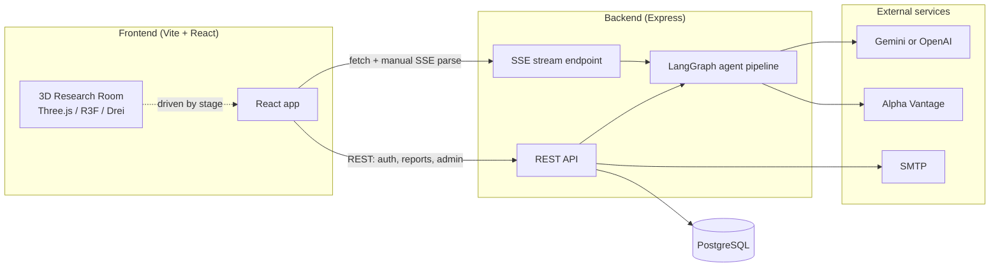
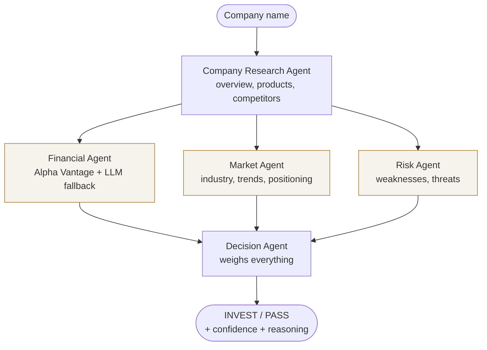

# InvestAI

**An AI investment research analyst, not another stock dashboard.**

Type a company name. Five specialized AI agents research it the way a real
analyst team would — one studies the business, three work in parallel on
financials/market/risk, and a lead analyst weighs everything into a final
**INVEST or PASS** call with a confidence score and full reasoning. A 3D
research room visualizes the analyst actually working through each stage in
real time, driven by genuine backend progress rather than an animation timer.

---

## Table of contents

- [Overview](#overview)
- [Architecture](#architecture)
- [How the AI agents work](#how-the-ai-agents-work)
- [Installation](#installation)
- [Environment variables](#environment-variables)
- [Example: researching a company](#example-researching-a-company)
- [Design decisions](#design-decisions)
- [What's been verified](#whats-been-verified)
- [Tradeoffs](#tradeoffs)
- [Future improvements](#future-improvements)
- [Project structure](#project-structure)

---

## Overview

InvestAI is a full-stack MERN application with a LangGraph multi-agent
pipeline at its core. A user account system (JWT + email verification +
admin approval) gates access; once in, a user can research any company and
get back a structured, saved report they can revisit later.

**What it does, concretely:**

1. User enters a company name (e.g. "Tesla")
2. A **Company Research Agent** establishes what the business actually does
3. **Financial**, **Market**, and **Risk** agents run *in parallel*, each
   reading the company overview and doing their own analysis
4. A **Decision Agent** reads all four outputs and commits to INVEST or PASS,
   with a confidence score, positive factors, and risks
5. The result is saved to MongoDB and shown as a decision card, a reasoning
   panel (per-agent breakdown), and a score chart

**Core features:**

- JWT auth with email verification (SMTP) and admin approval
- Admin approval workflow — the first registered account becomes an
  auto-approved admin; everyone after that needs approval from that admin
- Real-time research progress via Server-Sent Events, driven by actual
  backend agent completions, not a fake timer
- A 3D research room (Three.js + React Three Fiber) whose avatar's posture
  and status label reflect genuine pipeline progress
- Swappable LLM provider (Gemini free tier by default, OpenAI as a drop-in
  alternative) via one environment variable
- Financial data sourced from Alpha Vantage where possible, with an honest,
  clearly-labeled fallback to AI estimates when it isn't

---

## Architecture



**Backend:** Node.js + Express + PostgreSQL. `routes/` map HTTP verbs
to `controllers/`, which use `models/` and the `agents/` pipeline.
`middleware/` handles JWT verification and role checks, `utils/` holds small
reusable pieces (email sending, token generation, the async-error wrapper).

**Frontend:** Vite + React 18 + React Router + Tailwind v4. `api/` holds thin
wrappers around backend endpoints, `context/AuthContext.jsx` is the single
source of truth for "who's logged in," `components/` are reusable pieces,
`pages/` are routes. The Research page (and its Three.js dependency weight)
is lazy-loaded, so logging in or reading the landing page never downloads it.

**Why PostgreSQL over a document store:** Financial applications demand high data integrity, transactional constraints (ACID), and relational schemas (e.g., matching portfolio transactions to specific user accounts). PostgreSQL provides this rigorous structure. For unstructured data like multi-agent research analysis documents, we leverage PostgreSQL's native JSON capabilities (stored as serialized structures), combining relational reliability with document flexibility.

---

## How the AI agents work



Built with **LangGraph.js** (`backend/src/agents/researchGraph.js`), not five
independent LLM calls glued together in a controller.

- **Company Agent runs first.** Every other agent reads its output
  (`companyOverview`) from shared graph state, so all four downstream agents
  reason about the same facts instead of each forming an inconsistent
  picture.
- **Financial, Market, and Risk run in parallel**, not sequentially — they
  only need the company overview, not each other's output. This was verified
  directly rather than assumed: `graph.stream()` yields a separate chunk the
  moment *each* parallel agent individually finishes, which was worth
  confirming since batching them into one combined chunk per "superstep" was
  the more likely-sounding default.
- **Decision Agent runs exactly once**, only after all three parallel
  branches finish — LangGraph's own join semantics, not custom code. It's
  kept separate from the Risk Agent deliberately: Risk only has to list
  problems, Decision has to weigh positives against negatives and commit to
  a call.
- Every agent uses **structured output** (`withStructuredOutput` + a Zod
  schema), not free-text parsing — the model is constrained to a specific
  JSON shape, so the pipeline never has to guess whether a response parses.

**Real-time progress, not a fake progress bar.** `streamResearch()` uses
`graph.stream()` instead of `graph.invoke()`, yielding a progress event at
the moment each agent *actually* completes. `GET /api/research/stream`
exposes this as Server-Sent Events; the frontend drives the 3D avatar's
posture and status label from that real backend state.

**Honest data sourcing.** The Financial Agent tries Alpha Vantage first
(ticker lookup, then company fundamentals). If that fails for *any* reason —
no API key, symbol not found, free-tier daily limit hit — it falls back to
LLM reasoning, and labels the result `dataSource: "llm_estimate"` vs.
`"alpha_vantage"` so the UI can show which one the user is looking at,
instead of silently presenting a model's guess as verified market data.

---

## Installation

**Prerequisites:** Node.js 18+ (built and tested against Node 22), and a
PostgreSQL database (either a local server, a Docker container, or a hosted service like Neon).

### 1. Backend

```bash
cd backend
npm install
cp .env.example .env
# edit .env - at minimum set POSTGRES_URI, JWT_SECRET, and GOOGLE_API_KEY
npm run dev
```

Runs on `http://localhost:5000`. Confirm it's up: `curl http://localhost:5000/api/health`

### 2. Frontend

In a second terminal:

```bash
cd frontend
npm install
cp .env.example .env
# default VITE_API_URL already points at the backend above
npm run dev
```

Runs on `http://localhost:5173`.

### 3. Getting API keys (all free)

- **Gemini (default LLM):** [aistudio.google.com/apikey](https://aistudio.google.com/apikey) —
  no credit card, no expiry.
- **Alpha Vantage (optional, real financial data):**
  [alphavantage.co/support/#api-key](https://www.alphavantage.co/support/#api-key) —
  free tier is 25 requests/day; the app works fine without it.
- **SMTP (optional, for real verification/reset emails while developing):**
  [Mailtrap](https://mailtrap.io) or [Ethereal Email](https://ethereal.email)
  give free fake SMTP credentials that catch emails in a browser instead of
  actually sending them. Without SMTP configured, manually set
  `is_verified = true` on the user record in PostgreSQL to unblock login.

### 4. First login

Register the **first** account — it's automatically made an admin and
auto-approved. Verify its email, log in, and you can approve any further
accounts you register from `/admin`.

---

## Environment variables

### Backend (`backend/.env`)

| Variable | Required | Description |
|---|---|---|
| `PORT` | No (default `5000`) | Server port |
| `CLIENT_URL` | Yes | Frontend URL — used for CORS and email links |
| `POSTGRES_URI` | Yes | PostgreSQL connection string |
| `JWT_SECRET` | Yes | Any long random string |
| `JWT_EXPIRE` | No (default `7d`) | Token lifetime |
| `SMTP_HOST` / `SMTP_PORT` / `SMTP_USER` / `SMTP_PASS` / `SMTP_FROM` | Yes | Email verification + reset |
| `LLM_PROVIDER` | No (default `gemini`) | `gemini` or `openai` |
| `GOOGLE_API_KEY` | If using Gemini | Google AI Studio key |
| `OPENAI_API_KEY` | If using OpenAI | OpenAI API key |
| `ALPHA_VANTAGE_API_KEY` | No | Real financial data; falls back to AI estimate without it |

### Frontend (`frontend/.env`)

| Variable | Required | Description |
|---|---|---|
| `VITE_API_URL` | No (default `http://localhost:5000/api`) | Backend API base URL |

---

## Example: researching a company

Searching **"Tesla"** produces a saved report shaped like:

```json
{
  "company": "Tesla",
  "decision": "INVEST",
  "confidence": 78,
  "summary": "Tesla remains a market leader with strong brand power, though growth has slowed and competition is intensifying.",
  "positiveFactors": ["Market leadership", "Energy business diversification", "Brand strength"],
  "risks": ["Slowing growth", "Rising EV competition", "Valuation premium"],
  "analysis": {
    "companyOverview": { "overview": "...", "products": ["..."], "businessModel": "...", "competitors": ["..."] },
    "financial": { "revenueSummary": "...", "growthScore": 62, "dataSource": "alpha_vantage" },
    "market": { "industry": "Electric vehicles", "trends": ["..."], "competitivePosition": "..." },
    "risk": { "weaknesses": ["..."], "threats": ["..."], "overallRiskLevel": "MEDIUM" }
  }
}
```

While that runs, the frontend receives a live event sequence like:

```
progress  { stage: "company",  label: "Reading company reports" }
progress  { stage: "parallel", label: "Checking financial performance, market position, and risk" }
substep   { node: "marketAgent",    completed: 1, total: 3 }
substep   { node: "riskAgent",      completed: 2, total: 3 }
substep   { node: "financialAgent", completed: 3, total: 3 }
progress  { stage: "decision", label: "Preparing investment decision" }
done      { ...full saved report }
```

### Full Example Reports
For complete outputs across different companies and decisions, see the [example_runs](./example_runs) directory:
- [Tesla (TSLA) — INVEST (78% Confidence)](./example_runs/tesla_report.json)
- [NVIDIA (NVDA) — INVEST (92% Confidence)](./example_runs/nvidia_report.json)
- [Apple (AAPL) — PASS (72% Confidence)](./example_runs/apple_report.json)

---

## Design decisions

- **Structured output over prompt-and-parse.** Every agent uses a Zod schema
  with `withStructuredOutput`, not "please respond in JSON" plus manual
  parsing — eliminates an entire class of "the model wrapped it in markdown
  fences" bugs.
- **LLM provider is swappable, not hardcoded.** `config/llm.js` is the only
  place that constructs a model. Agents ask it for "the LLM" without knowing
  or caring whether that's Gemini or OpenAI underneath.
- **SSE over WebSockets for progress.** Data only ever flows server →
  client for this feature; a full-duplex WebSocket connection would be more
  machinery than the problem needs.
- **SSE consumed via `fetch()`, not `EventSource`.** The browser's native
  `EventSource` can't send a custom `Authorization` header, and every other
  request in this app authenticates that way. Rather than special-case one
  endpoint to accept a token in the URL query string (which then leaks into
  server logs and browser history), the frontend reads the response body
  manually as a stream and parses the SSE format itself
  (`frontend/src/api/streamResearch.js`).
- **`bcryptjs` over `bcrypt`.** Identical API, pure JavaScript — no native
  compilation step to fail on a reviewer's machine.
- **Hashed tokens, not plain tokens, in the database.** Email verification
  and password reset tokens are SHA-256 hashed before storage, the same
  principle as never storing a plain password.
- **Admin bootstrap via "first user."** The spec calls for admin approval of
  new users but doesn't say how the *first* admin comes to exist. The first
  account ever created is auto-approved as admin; every account after that
  needs that admin's approval.
- **The 3D avatar's progress is real, not simulated.** The single decision
  that took the most verification work — testing `graph.stream()`'s actual
  chunk behavior before writing any UI around it, rather than assuming and
  building a fake timer that merely *looked* real.

---

## What's been verified

Every non-trivial piece of this project was tested as it was built, not just
written and assumed to work:

- Every backend module has been syntax-checked and import-tested after every
  change, including after two dependency version upgrades.
- The LangGraph pipeline's parallel fan-out/fan-in behavior was verified
  with stub agents before real agents were written, then re-verified with
  the real agent files using a mocked LLM client — exercising the actual
  prompts, Zod schemas, and state wiring, with only the network call faked.
- The streaming SSE endpoint's exact event sequence was verified the same
  way, and the frontend's hand-written SSE parser was separately
  unit-tested against a message deliberately split across network-chunk
  boundaries, since that's the edge case a naive parser gets wrong.
- The frontend was built and its custom Tailwind v4 design tokens confirmed
  to compile to the correct CSS output — not just assumed from config.
- `npm audit` findings were investigated individually rather than reflexively
  fixed or ignored: a real high-severity LangSmith vulnerability was
  upgraded past (after confirming the app never calls LangSmith and
  re-verifying the graph still worked post-upgrade), while a dev-server-only
  esbuild advisory was deliberately left, since fixing it meant a 3-major
  -version Vite jump for a vulnerability that never reaches production.
- Both real servers were booted together, and a real HTTP request — CORS
  preflight, JSON body, auth header, the works — was sent from a simulated
  frontend origin to the real backend routing/middleware stack. It reached
  as far as it honestly could without a live database: the request correctly
  reached the User model and then failed trying to query a database that
  wasn't there in this sandboxed environment, proving everything above the
  database layer works correctly while being upfront that the database
  layer itself needs testing with your own real `MONGO_URI`.

What this means practically: once you provide a real `MONGO_URI` and API
keys, the parts that could only be verified up to "everything except the
actual external call" should work immediately — that boundary is the one
thing that honestly couldn't be tested inside the environment this was built
in.

---

## Tradeoffs

Deliberate scope cuts, with reasoning — not oversights:

- **No historical revenue chart.** The spec asks for a "revenue trend"
  chart; Alpha Vantage's free tier gives a snapshot, not multi-year history.
  Rather than fabricate believable-looking fake numbers, the chart shows
  real values the pipeline actually produces (growth score, risk score,
  confidence) instead. A real fix would call Alpha Vantage's
  `INCOME_STATEMENT` endpoint for actual historical figures.
- **JWT in `localStorage`, not an httpOnly cookie.** Simpler to implement
  and explain, but vulnerable to token theft via XSS in a way an httpOnly
  cookie wouldn't be. Acceptable for this scope; not what a production
  fintech app should ship.
- **No automated test suite.** Verified thoroughly during development (see
  above) via exploratory sandbox scripts, but not a committed `tests/`
  directory that runs in CI. A real gap for a production app.
- **No retry or partial-failure handling per agent.** If one agent's LLM
  call fails mid-pipeline, the whole research run fails. A production
  version would retry individual agents and could return a partial report.
- **No SSE reconnection.** If the connection drops mid-stream, the frontend
  shows an error rather than resuming — the user has to re-search. The
  non-streaming `POST /api/research` endpoint is unaffected and could serve
  as a fallback here.
- **No rate limiting.** Nothing stops one user from spamming research
  requests, which matters more once Alpha Vantage's or the LLM provider's
  usage costs are real.

---

## Future improvements

- Real historical financial data via Alpha Vantage's `INCOME_STATEMENT` /
  `EARNINGS` endpoints, replacing the current score-based chart substitute
- A proper automated test suite (Vitest/Jest for units, Supertest for the
  API) instead of manual sandbox verification
- Per-agent retry with exponential backoff, and partial-report support if
  one agent fails but the others succeed
- Rate limiting (e.g. `express-rate-limit`) on research and auth endpoints
- httpOnly cookie-based auth instead of `localStorage`
- A self-serve "request access" flow instead of admin-only approval
- Company autocomplete in the search bar (currently free-text only)

---

## LLM Chat Session Transcripts

This project was built iteratively in collaboration with the Gemini LLM assistant. In accordance with the bonus requirements, all of the interactive conversation sessions and execution logs have been extracted from the local database and compiled into human-readable Markdown format.

You can inspect the complete logs of our development, refactoring, and debugging sessions in the [llm_transcripts](./llm_transcripts) directory:
- [Session Index & Overview](./llm_transcripts/README.md)
- [Core Frontend/Backend Deployment & Configuration](./llm_transcripts/session_bd8a477d.md)
- [Real-time Notifications & Date-Time fixes](./llm_transcripts/session_312d4a41.md)
- [OTP verification & Admin redirection controls](./llm_transcripts/session_e3016e7b.md)

---

## Project structure

```
investai/
├── backend/
│   └── src/
│       ├── agents/          # 5 LangGraph agents + graph orchestration
│       ├── config/          # DB connection, LLM provider factory
│       ├── controllers/     # auth, research, admin
│       ├── middleware/      # JWT auth, role checks, error handling
│       ├── models/          # User, ResearchReport
│       ├── routes/
│       ├── utils/           # email, tokens, Alpha Vantage client
│       └── server.js
└── frontend/
    └── src/
        ├── api/              # axios instance + endpoint wrappers
        ├── components/       # Navbar, 3D scene, decision/reasoning UI
        ├── context/          # AuthContext
        ├── pages/            # Home, auth pages, Dashboard, Research, Admin
        ├── App.jsx
        └── main.jsx
```
